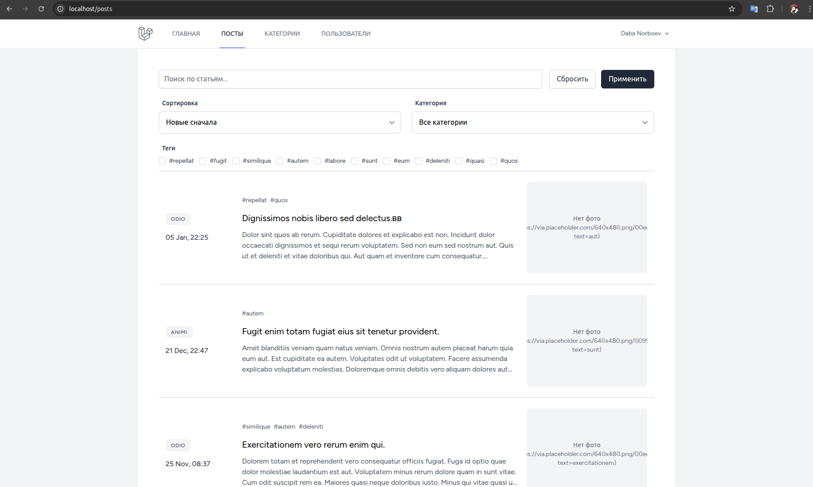
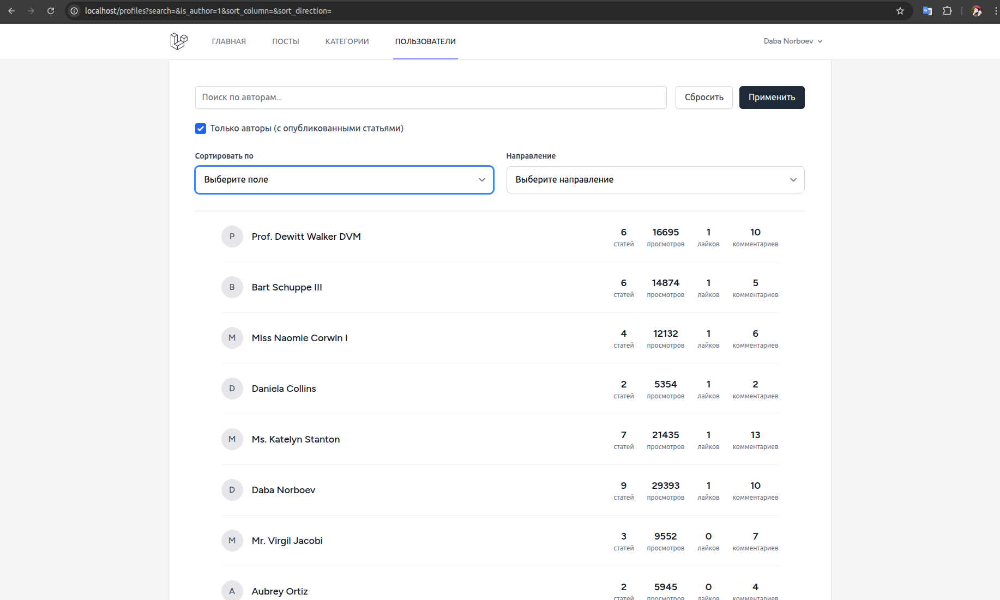
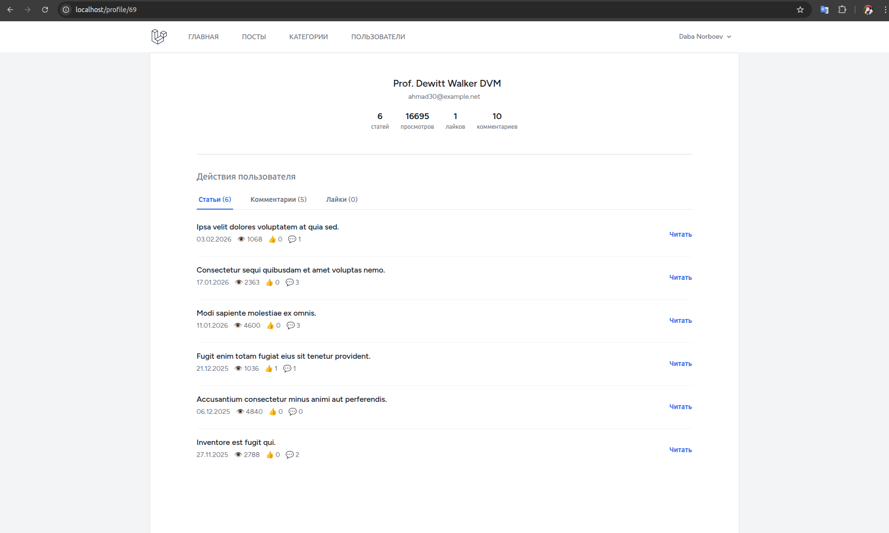
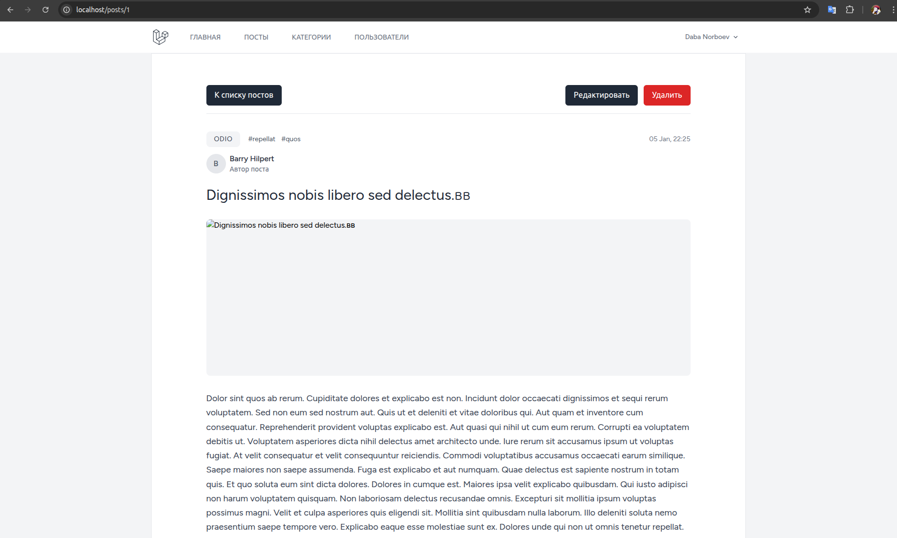
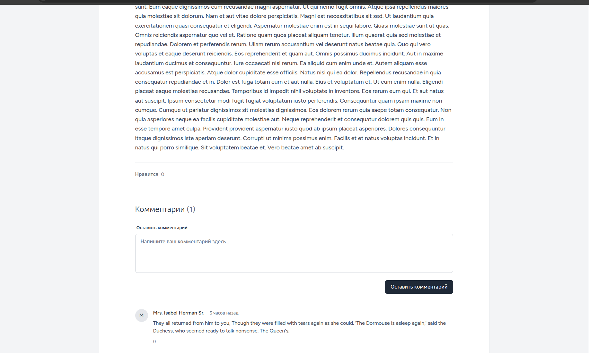

# Laravel Blog
Блог на Laravel 12 с функционалом управления статьями, комментариями к ним, лайками и статистикой авторов.

## Tech Stack
- **PHP** 8.3 / **Laravel** 12
- **PostgreSQL** 13
- **Nginx**
- **Docker Compose**
- **Tailwind CSS** / **Laravel Breeze**

## Features
- Список статей с фильтрацией и сортировкой (без сторонних пакетов)
- Система лайков для постов и комментариев
- Лента комментариев к каждому посту
- Страница статистики автора — агрегированные лайки, просмотры, комментарии, количество постов
- Профиль пользователя — понравившиеся посты, написанные комментарии с контексlarтом поста
- Управление категориями (круд)
- Система тегов (прикрепляется к постам через фабрику/сидер)
- Пагинация по всему коду
- Валидация форм с помощью request классов с наследованием
  (`StoreRequest extends BaseRequest`)
- Реализованы однометодные контроллеры для постов
- Логика из контроллеров постов выделена в сервис
- Заполнение базы данных с помощью фабрик и сидеров

## Screenshots

